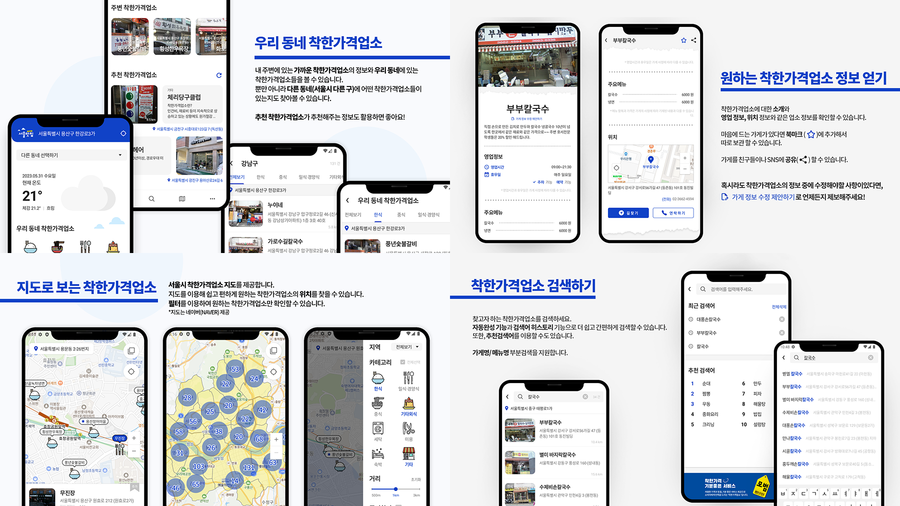

# 서울맛칩 2.0 
서울시에서 선정한 착한가격업소에 대한 정보앱
 
🏆 「2023 서울 열린데이터광장 공공데이터 활용 모바일 앱/웹 경진대회」 일반부 **최우수상** 수상 
 

 

 

 

### 주요기능
화면|내용|기능
------|---|---
홈|현재 위치의 동네 정보와 서울시 착한가격업소 목록|- 우리 동네 착한가격업소 - 서울시 착한가격업소 - 추천 착한가격업소 
검색|서울시 착한가격업소 검색|- 검색어 히스토리 - 추천 검색어 - 검색어 자동완성 - 띄어쓰기 상관없이 부분검색 지원
지도|서울시 착한가격업소 지도|- Zoom 배율이 높을 때는 내 위치 중심 지도 제공 - Zoom 배율이 낮을 때는 서울시 모양의 숫자 지도 제공 - 이 지역 재검색 - 필터 : 지역, 카테고리, 거리, 즐겨찾기
업소 상세화면|착한가격업소 정보|- 업소 정보(소개, 정보, 메뉴, 위치) - 연락하기, 길 찾기 - 즐겨찾기 저장 - SNS 공유하기
편의|서울맛칩 앱 편의기능|- 즐겨찾기 관리  - 푸시알림 설정  - 앱 바로가기(Shortcut) 메뉴

 

## Skills
     
+ AAC(Android Architecture Component) : Lifecycles, LiveData, ViewModel, Room, Paging, DataBinding, Navigation, WorkManager
+ Dagger-Hilt
+ Restrofit2
+ Coroutine
+ Naver Map SDK
+ FusedLocaionProvider
+ Firebase RemoteConfig
+ Firebase Dynamic Link
+ LeakCanary
+ Alram Manager
+ Glide
+ Jsoup
+ UI: ConstaintLayout, Motion Layout, ViewPager2, TabLayout, RecyclerView, Lottie

 

## Release Note

2.1.0 (2023.9.7)

1. 앱의 로딩속도 개선 : 기존 5초 -> 2초 
2. 지도에서 "재검색"기능 추가 
3. 착한가격업소 사진이 나오지 않는 현상 수정 

    

2.0.1 (2023.6.2)

출시 후 버그 수정 : 동네 정보 불러오지 못하는 문제, 메뉴 정보를 네트워크에서 불러오지 못하는 문제

   

2.0.0 (2023.6.1)

서울맛칩2.0을 출시합니다. 서울맛칩은 서울시에서 선정한 착한가격업소 정보앱입니다!

   

 

## Links
서울맛칩 개발기록 : [링크](https://reflective-goose-443.notion.site/0b89bddfb6334d178d6f6c45f1d71182?pvs=4) 
서울맛칩 다운로드 : [링크](https://play.google.com/store/apps/details?id=com.sandy.seoul_matcheap)  

